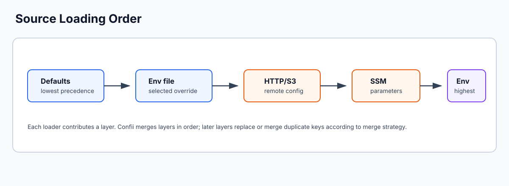
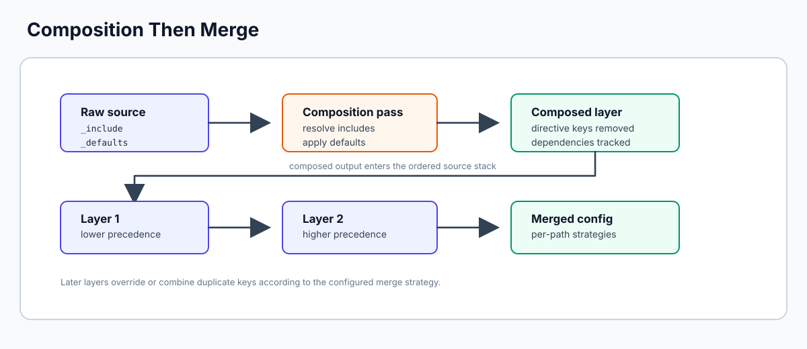
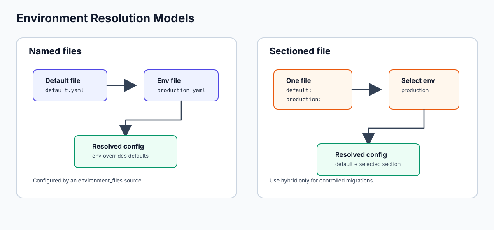
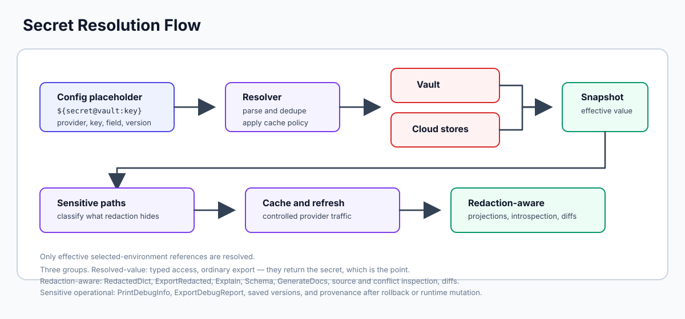
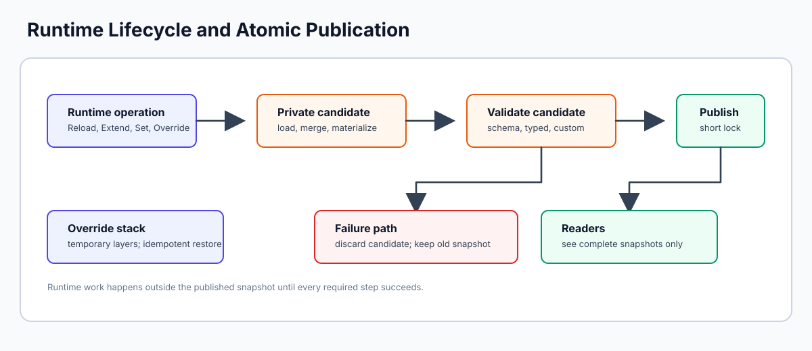

<!-- markdownlint-disable MD033 MD041 -->
<p align="center">
  
</p>

<p align="center">
  <strong>Complete configuration management for Go.</strong><br>
  Load, merge, validate, resolve secrets, track sources, detect drift — from any source.
</p>

<p align="center">
  <a href="https://pkg.go.dev/github.com/confiify/confii-go/v2"></a>
  <a href="https://github.com/confiify/confii-go/releases/latest"></a>
  <a href="https://github.com/confiify/confii-go/actions/workflows/ci.yaml"></a>
  <a href="https://codecov.io/gh/confiify/confii-go"></a>
  <a href="https://www.bestpractices.dev/projects/12279"></a>
  <a href="https://www.bestpractices.dev/projects/12279"></a>
  <a href="https://securityscorecards.dev/viewer/?uri=github.com/confiify/confii-go"></a>
  <a href="https://api.reuse.software/info/github.com/confiify/confii-go"></a>
  <a href="LICENSE"></a>
</p>

<p align="center">
  <a href="SECURITY.md">Security Policy</a> ·
  <a href="security-insights.yml">Security Insights 2.2</a> ·
  <a href="docs/SECURITY_TOOLING.md">Security Tooling</a> ·
  <a href="docs/RELEASING.md">SBOMs &amp; Provenance</a>
</p>
<!-- markdownlint-enable MD033 MD041 -->

---

## Table of Contents

- [Why Confii?](#why-confii)
- [Security & Supply-Chain Assurance](#security--supply-chain-assurance)
- [Installation](#installation)
- [Quick Start](#quick-start)
- [Learning & Onboarding](#learning--onboarding)
- **Configuring Confii**
  - [Creating a Config Instance](#creating-a-config-instance) — constructor, builder, self-config, options
  - [Configuration Sources](#configuration-sources) — files, env vars, HTTP, cloud
  - [Configuration Composition](#configuration-composition) — `_include`, `_defaults`
  - [Environment Resolution](#environment-resolution) — `default` + env-specific merging
  - [Merge Strategies](#merge-strategies) — selectable strategies with per-path overrides
- **Working with Values**
  - [Accessing Values](#accessing-values) — `Get`, typed getters, `Typed()`
  - [Hooks & Transformation](#hooks--transformation) — key, value, condition, and global hooks
  - [Validation](#validation) — struct tags, JSON Schema
  - [Secret Management](#secret-management) — `${secret:key}`, cloud stores
- **Runtime & Operations**
  - [Lifecycle Management](#lifecycle-management) — reload, extend, freeze, override
  - [Dynamic Reloading](#dynamic-reloading) — file watching via fsnotify
  - [Observability](#observability) — metrics, events
- **Debugging & Auditing**
  - [Introspection & Source Tracking](#introspection--source-tracking) — Explain, Layers, debug reports
  - [Diff & Drift Detection](#diff--drift-detection) — compare configs, detect unintended changes
  - [Versioning & Rollback](#versioning--rollback) — snapshots, compare, restore
- **Output**
  - [Export](#export) — JSON, YAML, TOML
  - [Documentation Generation](#documentation-generation)
- [CLI Tool](#cli-tool)
- [Examples](#examples)
- [Package Structure](#package-structure)

---

## Why Confii?

Go has several configuration libraries, but none provides a complete configuration *management* solution. Most handle loading and reading — Confii handles the full lifecycle.


| Capability | Confii | Viper | Koanf | Others |
| --- | :---: | :---: | :---: | :---: |
| File formats (YAML/JSON/TOML/INI/.env) | All 5 | All 5 | 4 | Partial |
| Cloud sources (S3, SSM, Azure, GCS, IBM, Git) | All 6 | etcd/Consul | S3, etcd | Limited |
| Secret stores (Vault, AWS, Azure, GCP) | All 4 + env | No | Vault | Limited |
| Per-path merge strategies | Yes | No | Global only | No |
| Config composition (`_include`/`_defaults`) | Yes | No | No | No |
| Type-safe generics (`Config[T]`) | Yes | No | No | No |
| `${secret:key}` placeholder resolution | Yes | No | No | No |
| Source tracking / introspection | Yes | No | No | No |
| Config diff / drift detection | Yes | No | No | No |
| Versioning with rollback | Yes | No | No | No |
| Observability (metrics, events) | Yes | No | No | No |
| Hook/middleware system | Yes | No | No | No |
| File watching + incremental reload | Yes | Yes | Yes | Partial |
| JSON Schema validation | Yes | No | No | No |
| CLI tool | Yes | No | No | No |
| Thread-safe (RWMutex) | Yes | [No](https://github.com/spf13/viper/issues/268) | Partial | Varies |

<!-- markdownlint-disable MD033 -->
<details>
<summary><strong>What Confii solves that others don't</strong></summary>
<!-- markdownlint-enable MD033 -->

**1. The multi-source merge problem.** Viper's deep merge has [known limitations](https://github.com/spf13/viper/issues/181) with slices and nested maps. Confii provides selectable merge strategies with per-path overrides — so `database` can use `replace` while `features` uses `append` in the same merge.

**2. Secret management as a first-class concern.** Confii natively resolves `${secret:db/password}` placeholders from AWS Secrets Manager, Azure Key Vault, GCP Secret Manager, HashiCorp Vault, and OpenBao — with caching, TTL, and a pluggable store interface. The Vault-compatible integration exposes nine auth adapters, using official HashiCorp packages where available; CI live-tests Token and AppRole against OpenBao, while the remaining adapters have protocol-level tests and require provider-side identity configuration.

**3. Environment-aware configuration.** Confii supports both recommended named files (`config/default.yaml` + `config/{environment}.yaml`) and a single file with `default` + environment sections. Teams choose one primary model; explicit hybrid mode exists for controlled migrations.

**4. Type safety with Go generics.** `Config[AppConfig]` gives you `cfg.Typed()` returning `*AppConfig` with struct tag validation and full IDE autocomplete.

**5. Configuration lifecycle management.** Diff two configs, detect drift from a baseline, snapshot versions and rollback, track access metrics, emit events on change — features that matter in production but don't exist elsewhere.

**6. Full introspection.** `Explain("database.host")` tells you the value, where it came from, how many times it was overridden, and the full history. `Layers()` shows the source stack. `GenerateDocs("markdown")` produces a reference table.

</details>

---

## Security & Supply-Chain Assurance

Confii treats security claims as testable release controls. The repository
publishes machine-readable security metadata and continuously exercises the
security-sensitive integrations it advertises.

| Control | Evidence |
| --- | --- |
| Static and dependency analysis | CodeQL, Govulncheck, OSV-Scanner, dependency review, and Gitleaks run in CI |
| Fuzzing | All 11 native Go fuzz targets run in CI; Fuzz Introspector produces a call-graph and complexity report |
| OpenBao interoperability | CI tests Token and AppRole authentication plus KV v2 operations against digest-pinned OpenBao 2.6.1 |
| Security metadata | [`security-insights.yml`](security-insights.yml) conforms to OpenSSF Security Insights 2.2 |
| Release integrity | The release pipeline produces SPDX 2.3 SBOMs, OpenVEX records, checksums, Sigstore bundles, and SLSA provenance |
| SBOM interoperability | Every release SBOM is imported and re-exported through commit-pinned bomctl/protobom |
| Continuous policy monitoring | An audit-only Minder profile is published; hosted activation and its current status are documented separately |

See [Security Tooling](docs/SECURITY_TOOLING.md), the
[Security Policy](SECURITY.md), and the [Release Process](docs/RELEASING.md)
for boundaries and verification details.

---

## Installation

The library and CLI have different scopes. Run `go get` from the root of an
existing Go module; it updates that project's `go.mod` and `go.sum`. Run
`go install` from any directory; it installs the standalone CLI without
changing the current project.

```bash
# From the root of an existing Go module
go get github.com/confiify/confii-go/v2@latest

# From any directory
go install github.com/confiify/confii-go/v2/confii@latest
confii --version
```

Contributors and prerelease testers can install the current checkout with
traceable development version metadata:

```bash
make install-dev
confii --version  # dev-<commit>, with -dirty when applicable
```

Use `make install-dev INSTALL_DIR="$PWD/bin/dev-install"` to avoid replacing an
existing released CLI. See the [installation guide](docs/installation.md#install-a-development-checkout)
for the complete workflow.

```bash
make uninstall  # removes confii from the resolved Go installation directory
```

To test the unreleased library from another Go project, use a commit-pinned
`go get` for pushed changes or `make consumer-link-dev
CONSUMER_DIR=/absolute/path/to/project` for the local working tree. Cloud
consumers use `consumer-link-dev-cloud` so the root, loader, and secret modules
stay aligned. The [development consumer guide](docs/installation.md#use-an-unreleased-library-in-another-project)
covers verification and cleanup.

Starting from an empty directory? Follow the complete sequence below; creating
the module before `go get` is required.

Cloud providers are opt-in through separate modules and build tags, so the
core install stays small. Add the cloud module you use; it owns compatible
provider SDK versions:

```bash
# Example: AWS
go get github.com/confiify/confii-go/loader/cloud/v2@latest
go get github.com/confiify/confii-go/secret/cloud/v2@latest
go build -tags aws ./...

# Other providers
go build -tags azure ./...
go build -tags gcp ./...
go build -tags vault ./...
go build -tags ibm ./...
```

See [docs/installation.md](docs/installation.md) for module and provider
details.

---

## Quick Start

From an empty directory, initialize a Go module and let Confii create the
recommended separate-file environment layout:

```bash
mkdir my-service
cd my-service
go mod init example.com/my-service
go get github.com/confiify/confii-go/v2@latest
go install github.com/confiify/confii-go/v2/confii@latest
confii --version
confii init
```

Choose **Separate files**. Confii generates a complete, documented
`.confii.yaml`, shared defaults in `config/default.yaml`, and development and
production override files. Load them without hard-coded paths:

```go
package main

import (
    "fmt"
    "log"

    confii "github.com/confiify/confii-go/v2"
)

type AppConfig struct {
    App struct {
        Name string `confii:"name"`
    } `confii:"app"`
    Server struct {
        Host string `confii:"host"`
        Port int    `confii:"port"`
    } `confii:"server"`
    Log struct {
        Level string `confii:"level"`
    } `confii:"log"`
}

func main() {
    cfg, err := confii.New[AppConfig]()
    if err != nil {
        log.Fatal(err)
    }
    values, err := cfg.Typed()
    if err != nil {
        log.Fatal(err)
    }
    fmt.Printf("%s listening on %s:%d (%s)\n",
        values.App.Name, values.Server.Host, values.Server.Port, values.Log.Level)
}
```

`New` supplies a background context and applies Confii's 60-second startup
timeout to source loading, secret resolution, hooks, and validation. Applications
that need startup to inherit cancellation, context values, or a custom deadline
can use `confii.NewWithContext[AppConfig](ctx)` instead. Configure the fallback with
`startup.timeout` in `.confii.yaml` or `confii.WithStartupTimeout`; an existing
caller deadline always wins.

Runtime context-aware APIs include `SetWithContext`, `OverrideWithContext`,
`Reload`, `Extend`, `RefreshSecrets`, `TypedWithContext`, and `DiffWithContext`. Reload and
Extend perform remote work on private candidates so readers retain the last
complete snapshot. Call `cfg.Close()` to stop watchers and release owned
provider/loader resources. Every paired explicit-context operation uses the
`OperationWithContext` spelling; Confii does not mix `Ctx` and `SetContext`
variants. See the [context lifecycle guide](docs/context.md).

```bash
# Preview the exact layers before starting the application
confii env
confii env list
confii plan
APP_ENV=production confii plan

# Run with the generated development default, then production
go run .
APP_ENV=production go run .
```

See the [from-scratch Quick Start](docs/quickstart.md) for the generated files,
runtime overrides, the single-file alternative, and expected output.

---

## Learning & Onboarding

Use these guides when you are choosing an approach or trying to debug a
configuration:

- [Mental Model](docs/mental-model.md) — how self-config, loaders, merge,
  environments, secrets, hooks, validation, and snapshots fit together.
- [Learning Paths](docs/learning-paths.md) — shortest documentation routes for
  typed config, environments, secrets, cloud config, production services, and
  customization.
- [Recipes](docs/recipes.md) — task-oriented copyable flows for common jobs.
- [Troubleshooting](docs/troubleshooting.md) — symptom-driven fixes for source
  order, environment selection, provider setup, validation, and working
  directory issues.
- [Extensibility](docs/extensibility.md) — custom loaders, secret stores,
  validators, hooks, exporters, and provider registries.
- [Testing](docs/testing.md) and [Production Checklist](docs/production-checklist.md)
  — application test patterns and deployment readiness checks.
- [Glossary](docs/glossary.md) — shared vocabulary for layers, candidates,
  snapshots, self-config, materialization, and providers.

---

## Configuring Confii

Confii supports three construction styles. Each style controls how
configuration is loaded, merged, validated, and accessed.

### Creating a Config Instance

There are three ways to create a `Config[T]` instance, listed from simplest to most flexible:

**1. Self-configuration file** (zero-code defaults) — Confii auto-discovers a `.confii.yaml` (or `.json`/`.toml`) file and applies settings *before* any code runs. This is the best place for project-wide defaults that every developer shares.

Bootstrap a project interactively. Confii asks whether to use separate
environment files or one sectioned file, and whether its self-config should be
YAML, JSON, or TOML. It then creates the complete, commented control plane and
a loadable starter layout:

```bash
confii init
```

For automation, make the decision explicit:

```bash
# Recommended: config/default.yaml + config/{environment}.yaml
confii init --non-interactive --strategy named-files

# Alternative: config/application.yaml with environment sections
confii init --non-interactive --strategy sectioned
```

Add `--format yaml`, `--format json`, or `--format toml` for deterministic
automation. YAML is the non-interactive default.

Initialization is idempotent. Confii detects every supported self-config
filename, reports an already initialized project without changing it, rejects
ambiguous initialization, rejects malformed existing configuration unless
`--force` is deliberately recovering the selected format, and
preflights every planned output before writing. Use `--dry-run` to inspect the
plan and `--force` only for an
intentional replacement. `--force` replaces only the selected plan and never
deletes files from an older layout, so review obsolete files manually.
Application source is not generated or edited; the
runtime integration remains `confii.NewWithContext[YourConfig](ctx)`.

```yaml
# .confii.yaml — auto-discovered from CWD or ~/.config/confii/
default_environment: development
env_switcher: APP_ENV
env_prefix: APP
environment_strategy: named_files
merge:
  default: deep_merge
  paths: {}
sources:
  - type: environment_files
    search_paths: [config]
    default_file: default.yaml
    environment_file: "{environment}.yaml"
```

For projects that keep one file per environment, opt in with an
`environment_files` source instead of hard-coding the selected file:

```yaml
# .confii.yaml
default_environment: development
env_switcher: APP_ENV
environment_strategy: named_files
sources:
  - type: environment_files
    search_paths: [config, .]
    default_file: default.yaml
    environment_file: "{environment}.yaml"
```

Confii loads the first `default.yaml` it finds, then the first file matching
the selected environment (for example `config/production.yaml`). The
environment file overrides the defaults. When `environment_strategy` is
omitted, declaring `environment_files` infers `named_files`. A normal flat
`type: yaml` source may still provide shared base values, but a file containing
top-level environment sections is rejected to prevent accidental mixed-model
precedence. Deliberate migrations can select `hybrid` with an explicit
`environment_conflict_policy` of `error`, `warn`, or `last_wins`.

Settings apply with 3-tier priority: **explicit code argument > self-config file > built-in default**. Hidden `.confii.<format>` files are preferred; visible `confii.<format>` files are the fallback. Mixed families or formats are rejected. A matching `.confii.<environment>.<format>` overlays the base.

> **Full example:** [`examples/self-config/`](examples/self-config/main.go)

**2. Constructor with options** — Pass `With*` option functions directly:

```go
cfg, err := confii.NewWithContext[AppConfig](ctx,
    confii.WithLoaders(loader.NewYAML("config.yaml")),
    confii.WithEnv("production"),
    confii.WithMergeStrategy(confii.StrategyMerge),
    confii.WithValidateOnLoad(true),
)
```

**3. Builder pattern** — Fluent API with chained methods, useful when config construction is conditional or spans multiple steps:

```go
cfg, err := confii.NewBuilder[AppConfig]().
    WithEnv("production").
    AddLoader(loader.NewYAML("base.yaml")).
    AddLoader(loader.NewYAML("prod.yaml")).
    WithMergeStrategy(confii.StrategyMerge).
    EnableFreezeOnLoad().
    BuildWithContext(ctx)
```

> **Full example:** [`examples/builder/`](examples/builder/main.go)

**Available options:**

| Option | Purpose | Default |
| --- | --- | --- |
| `WithLoaders(loaders...)` | Set configuration sources | none |
| `WithEnv(name)` | Set active environment (e.g. `"production"`) | `""` |
| `WithEnvSwitcher(envVar)` | Read environment name from OS variable | none |
| `WithEnvironmentStrategy(strategy)` | Select `Auto`, `Sectioned`, `NamedFiles`, or explicit `Hybrid` behavior | `Auto` |
| `WithEnvironmentConflictPolicy(policy)` | Control cross-model conflicts in hybrid mode | `LastWins` |
| `WithEnvPrefix(prefix)` | Auto-add an `EnvironmentLoader` with this prefix | none |
| `WithMergeStrategy(strategy)` | Default merge strategy | `Merge` |
| `WithMergeStrategyMap(map)` | Per-path merge strategy overrides | none |
| `WithValidateOnLoad(bool)` | Validate struct tags after loading | `false` |
| `WithStrictValidation(bool)` | Treat validation failures as errors when enabled | `true` |
| `WithValidator(validator)` | Add a transactional validation rule and enable validation | none |
| `WithExporter(exporter)` | Add or replace an export format serializer | JSON/YAML/TOML built in |
| `WithSchema(schema)` / `WithSchemaPath(path)` | JSON Schema for validation | none |
| `WithEnvExpander(bool)` | Enable `${VAR}` and `${env:VAR}` expansion in values | `true` |
| `WithFileResolver(bool)` | Enable `${file:path}` raw file-content expansion rooted at `WithWorkingDir` | `false` |
| `WithStructuredResolver(bool)` | Enable `${json:path#field}`, `${yaml:path#field}`, `${json:self#field}`, and `${yaml:self#field}` references | `false` |
| `WithURLResolver(bool)` | Enable `${url:...}` response-body expansion | `false` |
| `WithCommandResolver(bool)` | Enable `${cmd:...}` shell-command stdout expansion | `false` |
| `WithValueResolver(scheme, resolver)` | Add or override a custom `${scheme:...}` resolver | none |
| `WithTypeCasting(bool)` | Auto-convert strings to bool/int/float | `true` |
| `WithSysenvFallback(bool)` | Dynamically consult OS env vars for missing `Get`/`Has` paths without changing the published snapshot | `false` |
| `WithDynamicReloading(bool)` | Enable fsnotify file watching | `false` |
| `WithReloadDebounce(duration)` | Coalesce filesystem event bursts before automatic reload | `150ms` |
| `WithSensitivePaths(paths...)` | Redact application-defined paths in diagnostics and version comparisons | none |
| `WithFreezeOnLoad(bool)` | Make config immutable after load | `false` |
| `WithDebugMode(bool)` | Enable full source tracking | `false` |
| `WithOnError(policy)` | `ErrorPolicyRaise`, `Warn`, or `Ignore` | `Raise` |
| `WithLogger(logger)` | Custom `*slog.Logger` | default |

---

### Configuration Sources

Confii loads from files, environment variables, HTTP, and cloud storage — all through a unified `Loader` interface. Later loaders override earlier ones with deep merge enabled by default.



| Source | Constructor | Build Tag |
| --- | --- | --- |
| YAML | `loader.NewYAML(path)` | - |
| JSON | `loader.NewJSON(path)` | - |
| TOML | `loader.NewTOML(path)` | - |
| INI | `loader.NewINI(path)` | - |
| .env | `loader.NewEnvFile(path)` | - |
| Environment vars | `loader.NewEnvironment(prefix)` | - |
| HTTP/HTTPS | `loader.NewHTTP(url, opts...)` | - |
| AWS S3 | `cloud.NewS3(url, opts...)` | `aws` |
| AWS SSM | `cloud.NewSSM(prefix)` | `aws` |
| Azure Blob | `cloud.NewAzureBlob(container, blob)` | `azure` |
| GCS | `cloud.NewGCS(bucket, object)` | `gcp` |
| IBM COS | `cloud.NewIBMCOS(...)` | `ibm` |
| Git repo | `cloud.NewGit(repo, path, opts...)` | - |

> **Full example:** [`examples/multi-source/`](examples/multi-source/main.go) | [`examples/cloud/`](examples/cloud/main.go)

---

### Configuration Composition

Hydra-style `_include` and `_defaults` directives let you split config across files with cycle detection (max depth 10):



```yaml
_defaults:
  - "timeout: 30"
  - cache: redis

_include:
  - shared/logging.yaml
  - shared/database.yaml

app:
  name: my-service
```

Included files are resolved relative to the source file's directory. Directive keys (`_include`, `_defaults`, `_merge_strategy`) are removed from the final output.

> **Full example:** [`examples/composition/`](examples/composition/main.go)

---

### Environment Resolution

Config files with `default` + environment-specific sections are automatically merged:



```yaml
default:
  database:
    host: localhost
    port: 5432

production:
  database:
    host: prod-db.example.com
```

```go
cfg, _ := confii.NewWithContext[any](ctx,
    confii.WithLoaders(loader.NewYAML("config.yaml")),
    confii.WithEnv("production"),         // explicit
    // confii.WithEnvSwitcher("APP_ENV"), // or from OS variable
)
// database.host = "prod-db.example.com" (production)
// database.port = 5432                  (inherited from default)
```

> **Full example:** [`examples/environment/`](examples/environment/main.go)

---

### Merge Strategies

Six strategies with per-path overrides — different sections can merge differently:

| Strategy | Behavior |
| --- | --- |
| `Replace` | Overwrites entirely |
| `Merge` | Recursive deep merge |
| `Append` | Appends list items |
| `Prepend` | Prepends list items |
| `Intersection` | Keeps only common keys |
| `Union` | Keeps all keys, merges common ones |

```go
confii.WithMergeStrategyMap(map[string]confii.MergeStrategy{
    "database": confii.StrategyReplace,
    "features": confii.StrategyAppend,
})
```

> **Full example:** [`examples/merge-strategies/`](examples/merge-strategies/main.go)

---

## Working with Values

Once a `Config[T]` instance is created and loaded, here's how you access, transform, validate, and resolve values.

### Accessing Values

**Untyped access** with dot-notation key paths:

```go
val, err := cfg.Get("database.host")           // (any, error)
val := cfg.GetOr("database.host", "localhost")  // with default
val := cfg.MustGet("database.host")             // panics on error (for tests)
```

**Typed getters** with defaults:

```go
cfg.GetString("app.name")                   // (string, error)
cfg.GetStringOr("app.name", "default")      // with fallback
cfg.GetInt("database.port")                  // (int, error)
cfg.GetIntOr("database.port", 5432)
cfg.GetBool("debug")                         // (bool, error)
cfg.GetBoolOr("debug", false)
cfg.GetFloat64("threshold")                  // (float64, error)
```

**Typed struct access** with Go generics:

```go
cfg, err := confii.NewWithContext[AppConfig](ctx,
    confii.WithLoaders(loader.NewYAML("config.yaml")),
    confii.WithValidateOnLoad(true),
)

model, _ := cfg.Typed()              // *AppConfig — IDE autocomplete works
fmt.Println(model.Database.Host)
```

Use Confii's own `confii` struct tag when a configuration key differs from its
Go field name:

```go
LogLevel string `confii:"log_level"`
```

The supported mapping options include `-`, `squash`, and `remain`; see [Struct
Tags](docs/access.md#struct-tags).

**Other access methods:**

```go
cfg.Has("database.host")    // bool — key existence
cfg.Keys()                  // []string — all leaf keys
cfg.Keys("database")        // []string — keys under prefix
cfg.ToDict()                // (map[string]any, error) — materialized snapshot
cfg.Set("key", "value")     // set a value
```

The `GetOr` helpers intentionally return their default for any read or
conversion error. Use the corresponding error-returning getter when the
application must distinguish a missing key from a failed transformation.

> **Full example:** [`examples/basic/`](examples/basic/main.go) | [`examples/typed/`](examples/typed/main.go)

---

### Hooks & Transformation

Hooks transform values while Confii materializes a candidate snapshot. Four
types execute in order: key → value → condition → global. All read APIs then
observe the same published values without rerunning hooks.

| Hook Type | Fires When |
| --- | --- |
| **Key hook** | Key exactly matches a registered path |
| **Value hook** | Value exactly matches a registered value |
| **Condition hook** | Custom condition function returns `true` |
| **Global hook** | Every leaf while a candidate snapshot is materialized |

```go
cfg, err := confii.New[AppConfig](
    confii.WithLoaders(loader.NewYAML("config.yaml")),
    confii.WithKeyHook("app.name", func(ctx context.Context, key string, value any) (any, error) {
        return strings.ToUpper(value.(string)), nil
    }),
)
```

`Typed()` decodes the already-materialized map, so a key hook registered
for `server.host` is reflected in `model.Server.Host`. Direct field access after
`Typed()` returns is ordinary Go access and does not execute hooks again.
The hook plan is frozen once construction succeeds. Mutations and reloads use
that same plan transactionally. See [Hook System](docs/hooks.md).

**Built-in hooks** (enabled via options):

- `WithEnvExpander(true)` — replaces `${VAR}` and `${env:VAR}` with OS environment variables
- `WithFileResolver(true)` — replaces `${file:path}` with raw file contents before secret resolution
- `WithStructuredResolver(true)` — resolves `${json:path#field}`, `${yaml:path#field}`, and `self` field references before secret resolution
- `WithURLResolver(true)` — resolves `${url:...}` response bodies; enable only for trusted config
- `WithCommandResolver(true)` — resolves `${cmd:...}` through the platform shell; enable only for trusted config
- `WithValueResolver("scheme", resolver)` — adds or overrides a custom `${scheme:...}` resolver
- `WithTypeCasting(true)` — converts strings to bool/int/float automatically

> **Full example:** [`examples/hooks/`](examples/hooks/main.go)

---

### Validation

**Struct tags** — validate on load using `go-playground/validator`:

```go
type Config struct {
    Host string `confii:"host" validate:"required,hostname"`
    Port int    `confii:"port" validate:"required,min=1,max=65535"`
}

cfg, err := confii.NewWithContext[Config](ctx,
    confii.WithLoaders(loader.NewYAML("config.yaml")),
    confii.WithValidateOnLoad(true),
    confii.WithStrictValidation(true),  // reject typed validation failures
)
// Returns error at construction time if validation fails
```

**JSON Schema** — validate against a schema file:

```go
v, _ := validate.NewJSONSchemaValidatorFromFile("schema.json")
snapshot, err := cfg.ToDict()
if err == nil {
    err = v.Validate(snapshot)
}
```

> **Full example:** [`examples/validation/`](examples/validation/main.go)

---

### Secret Management

Secrets are resolved eagerly after source merging and environment selection.
`confii.New` returns only after the effective configuration is ready, so normal
getters do not contact Vault or a cloud provider.



```go
store := secret.NewDictStore(map[string]any{"db/password": "s3cret"})
resolver := secret.NewResolver(store,
    secret.WithCache(true),
    secret.WithCacheTTL(5 * time.Minute),
)

cfg, err := confii.NewWithContext[any](ctx,
    confii.WithLoaders(loader.NewYAML("config.yaml")),
    confii.WithSecretResolver(resolver),
)
if err != nil {
    return err // required secrets fail startup atomically
}

// ${secret:db/password} was resolved before New returned.
password, _ := cfg.Get("database.password") // in-memory read
_ = password

// Rotation is deliberate and preserves the last known-good snapshot on error.
err = cfg.RefreshSecretsWithContext(ctx)
```

**Placeholder formats:** `${secret:key}`, `${secret:key:json_path}`,
`${secret:key:json_path:version}`, and the declarative named-provider form
`${secret@provider:key[:json_path][:version]}`. Named providers support an
environment-specific default plus explicit per-reference routing, so one
application can use Vault for shared secrets and AWS/GCP/Azure for selected
environments without ambiguous fallback behavior. See
[Secret Management](docs/secrets.md#declarative-self-config-providers).

**Cloud secret stores** (build-tag gated):

| Store | Constructor | Build Tag |
| --- | --- | --- |
| AWS Secrets Manager | `cloud.NewAWSSecretsManager(ctx, opts...)` | `aws` |
| HashiCorp Vault | `cloud.NewHashiCorpVault(opts...)` | `vault` |
| OpenBao | `cloud.NewOpenBao(opts...)` | `vault` |
| Azure Key Vault | `cloud.NewAzureKeyVault(url, cred)` | `azure` |
| GCP Secret Manager | `cloud.NewGCPSecretManager(ctx, project)` | `gcp` |

The Vault-compatible integration provides Token, AppRole, LDAP, JWT,
Kubernetes, AWS IAM, Azure, GCP, and OIDC authentication implementations.
Confii continuously tests token and AppRole KV operations against a real,
digest-pinned OpenBao server; the other methods have protocol-level fixtures
and require their corresponding server-side identity providers.

**Multi-store fallback** — try stores in priority order:

```go
multi := secret.NewMultiStore([]confii.SecretStore{awsStore, vaultStore, envStore})
```

> **Full example:** [`examples/secrets/`](examples/secrets/main.go) | [`examples/cloud/`](examples/cloud/main.go)

---

## Runtime & Operations

The runtime API manages an initialized configuration throughout the
application lifecycle.

### Lifecycle Management



```go
// Reload from sources
cfg.ReloadWithContext(ctx)
cfg.ReloadWithContext(ctx, confii.WithIncremental(true))  // changed files only; remote sources refresh
cfg.ReloadWithContext(ctx, confii.WithDryRun(true))        // validate without applying
cfg.ReloadWithContext(ctx, confii.WithReloadValidate(true)) // override validate-on-load

// Extend at runtime — add a new source without reloading everything
cfg.ExtendWithContext(ctx, loader.NewJSON("extra.json"))

// Temporary override (scoped) — useful for tests
restore, _ := cfg.Override(map[string]any{"database.host": "test-db"})
defer restore()

// Set values (respects frozen state)
cfg.Set("key", "value")
cfg.Set("key", "value", confii.WithOverride(false))  // errors if key exists

// Freeze — make config immutable
cfg.Freeze()
cfg.Set("key", "val")  // returns ErrConfigFrozen

// Change callbacks — react to value changes
cfg.OnChange(func(key string, old, new any) {
    log.Printf("changed: %s = %v → %v", key, old, new)
})
```

> **Full example:** [`examples/lifecycle/`](examples/lifecycle/main.go)

---

### Dynamic Reloading

File watching via fsnotify. Config automatically reloads when source files change on disk:

```go
cfg, _ := confii.NewWithContext[any](ctx,
    confii.WithLoaders(loader.NewYAML("config.yaml")),
    confii.WithDynamicReloading(true),
    confii.WithReloadDebounce(150*time.Millisecond),
)
// Config auto-reloads once after a burst of file changes

cfg.OnChange(func(key string, old, new any) { /* react */ })
cfg.StopWatching() // stop when done
```

> **Full example:** [`examples/dynamic-reload/`](examples/dynamic-reload/main.go)

---

### Observability

Track access patterns, react to events:

```go
metrics := cfg.EnableObservability() // read-only metrics view
events := cfg.EnableEvents()         // subscription-only event view

events.On("reload", func(args ...any) { log.Println("reloaded") })
events.On("change", func(args ...any) { log.Println("changed") })

stats := metrics.Statistics()
// total_keys, accessed_keys, access_rate, reload_count, change_count, top_accessed_keys
```

> **Full example:** [`examples/observability/`](examples/observability/main.go)

---

## Debugging & Auditing

For troubleshooting config issues, auditing changes, and understanding where values came from.

### Introspection & Source Tracking

Know exactly where every value came from and how it got there:


```go
cfg.Explain("database.host")              // value, source, override count, full history
cfg.Schema("database.port")               // type info for a key
cfg.Layers()                              // source stack (which files, in what order)

cfg.GetSourceInfo("database.host")        // SourceInfo struct
cfg.GetOverrideHistory("database.host")   // []OverrideEntry — full override chain
cfg.GetConflicts()                        // all keys that were overridden
cfg.GetSourceStatistics()                 // aggregated stats per source
cfg.FindKeysFromSource("config.yaml")     // which keys came from this file

cfg.PrintDebugInfo("database.host")       // human-readable report
cfg.ExportDebugReport("report.json")      // full JSON export
```

Enable `WithDebugMode(true)` for complete override history tracking.

> **Full example:** [`examples/introspection/`](examples/introspection/main.go)

---

### Diff & Drift Detection

Compare two configs or detect unintended changes against an intended baseline:

```go
diffs, err := cfg1.Diff(cfg2)                  // compare two Config instances
drifts, err := cfg.DetectDrift(intendedConfig) // detect unintended changes
summary := diff.Summary(diffs)              // {total: 3, added: 1, removed: 1, modified: 1}
jsonStr, _ := diff.ToJSON(diffs)            // serialize for reporting
```

> **Full example:** [`examples/diff/`](examples/diff/main.go)

---

### Versioning & Rollback

Snapshot config state, compare versions over time, and rollback:

```go
versions := cfg.EnableVersioning("/tmp/config-versions", 100) // read-only history

v1, _ := cfg.SaveVersion(map[string]any{"author": "deploy-bot", "env": "prod"})
// ... config changes ...
v2, _ := cfg.SaveVersion(nil)

diffs, _ := versions.DiffVersions(v1.VersionID, v2.VersionID)
history := versions.ListVersions() // all snapshots, newest first
cfg.RollbackToVersion(v1.VersionID)
```

Rollback validates before publication, restores version-based source
attribution, and emits the same change callbacks, metrics, and lifecycle events
as other snapshot mutations.

> **Full example:** [`examples/versioning/`](examples/versioning/main.go)

---

## Output

### Export

```go
jsonData, _ := cfg.Export("json")
yamlData, _ := cfg.Export("yaml")
tomlData, _ := cfg.Export("toml")
cfg.Export("json", "/path/to/output.json")  // to file
```

> **Full example:** [`examples/export/`](examples/export/main.go)

### Documentation Generation

Generate a reference document from the current config:

```go
markdown, _ := cfg.GenerateDocs("markdown")
jsonDocs, _ := cfg.GenerateDocs("json")
```

---

## CLI Tool

```bash
go install github.com/confiify/confii-go/v2/confii@latest
```

| Command | Description |
| --- | --- |
| `confii init` | Safely scaffold `.confii.<format>` and the selected environment layout |
| `confii env` | Show the effective environment; list or safely change the configured default |
| `confii connections test` | Perform value-safe reads against configured sources and secret providers |
| `confii load` | Load and display configuration |
| `confii get` | Retrieve a single value |
| `confii export` | Export to a different format |
| `confii validate` | Validate against JSON Schema |
| `confii diff` | Compare two configs or environments |
| `confii debug` | Debug source tracking for a key |
| `confii explain` | Detailed resolution info for a key |
| `confii plan` | Show environment strategy, source order, and mixed-model conflicts |
| `confii lint` | Lint config for issues |
| `confii docs` | Generate documentation |
| `confii migrate` | Migrate from other config formats |

```bash
confii init
confii env list
confii env set production
confii plan
confii connections test
APP_ENV=production confii load
confii get database.host

# Explicit loaders remain available for ad hoc files and automation
confii load production -l yaml:config.yaml
confii get production database.host -l yaml:config.yaml
confii export production -l yaml:config.yaml -f json -o config.json
confii validate production -l yaml:config.yaml --schema schema.json
confii diff dev production --loader1 yaml:c.yaml --loader2 yaml:c.yaml
confii explain production -l yaml:config.yaml --key database.host
confii plan production
confii lint production -l yaml:config.yaml --strict
confii docs production -l yaml:config.yaml -f markdown -o DOCS.md
confii migrate dotenv .env -o config.yaml
```

---

## Examples

The [`examples/`](examples/) directory contains focused, runnable feature
samples. For a realistic CRUD application with environment, LocalStack cloud,
Vault/OpenBao, and CLI walkthroughs, use the companion
[`confiify/confii-go-examples`](https://github.com/confiify/confii-go-examples)
repository.

#### Getting Started

| Example | Description |
| --- | --- |
| [`basic`](examples/basic/main.go) | Load a YAML file, access values with dot notation |
| [`typed`](examples/typed/main.go) | Type-safe `Config[T]` with struct validation |
| [`builder`](examples/builder/main.go) | Fluent builder pattern |
| [`self-config`](examples/self-config/main.go) | `.confii.yaml` auto-discovery |

#### Loading & Merging

| Example | Description |
| --- | --- |
| [`multi-source`](examples/multi-source/main.go) | Multiple loaders + environment variables |
| [`environment`](examples/environment/main.go) | Environment-aware config (default + production) |
| [`merge-strategies`](examples/merge-strategies/main.go) | Per-path merge strategies |
| [`composition`](examples/composition/main.go) | `_include` and `_defaults` directives |
| [`cloud`](examples/cloud/main.go) | Cloud loaders and secret stores |

#### Processing & Validation

| Example | Description |
| --- | --- |
| [`hooks`](examples/hooks/main.go) | Key, value, condition, and global hooks |
| [`validation`](examples/validation/main.go) | Struct tags + JSON Schema validation |
| [`secrets`](examples/secrets/main.go) | Secret resolution with `${secret:key}` |
| [`mixed-secrets`](examples/mixed-secrets/main.go) | Environment defaults and explicit `${secret@provider:key}` routing |

#### Runtime & Debugging

| Example | Description |
| --- | --- |
| [`lifecycle`](examples/lifecycle/main.go) | Reload, freeze, override, change callbacks |
| [`dynamic-reload`](examples/dynamic-reload/main.go) | File watching with fsnotify |
| [`introspection`](examples/introspection/main.go) | Explain, Layers, source tracking, debug |
| [`observability`](examples/observability/main.go) | Metrics and event emission |
| [`versioning`](examples/versioning/main.go) | Snapshot, compare, and rollback |
| [`diff`](examples/diff/main.go) | Diff configs and detect drift |
| [`export`](examples/export/main.go) | Export to JSON/YAML/TOML + doc generation |

```bash
cd examples/basic && go run .
```

---

## Package Structure

```text
github.com/confiify/confii-go/
  ├── config.go              # Config[T] core state and construction
  ├── config_*.go            # Access, mutation, reload, override, hooks, validation, etc.
  ├── builder.go             # Fluent builder API
  ├── errors.go              # Sentinel errors + ConfigError
  ├── configmap/             # Public dot-path operations for custom integrations
  ├── loader/                # File & env loaders (YAML, JSON, TOML, INI, .env, HTTP)
  │   └── cloud/             # Cloud loaders (S3, SSM, Azure Blob, GCS, IBM COS, Git)
  ├── secret/                # Secret stores (env, dict, multi) + resolver
  │   └── cloud/             # Cloud secret stores (AWS, Azure, GCP, Vault)
  ├── merge/                 # Merge strategies (default + advanced with per-path overrides)
  ├── compose/               # Configuration composition (_include, _defaults)
  ├── envhandler/            # Environment resolution (default + env sections)
  ├── hook/                  # Key, value, condition, and global hooks
  ├── validate/              # Struct tag + JSON Schema validation
  ├── observe/               # Metrics, events, versioning with rollback
  ├── diff/                  # Diff + drift detection
  ├── sourcetrack/           # Per-key source tracking, override history
  ├── watch/                 # File watching (fsnotify)
  ├── export/                # JSON, YAML, TOML exporters
  ├── selfconfig/            # Self-configuration reader (.confii.yaml)
  ├── internal/              # Internal utilities (dictutil, typecoerce, formatparse)
  ├── integration/           # End-to-end integration tests
  ├── examples/              # Runnable examples
  └── confii/                # CLI tool
```

## Requirements

- Go 1.25+ (cloud integrations are separate opt-in modules)

---

## Testing Philosophy

Confii ships with a high test bar because configuration libraries are
hard to debug in production: a silently-mishandled value or a
torn-state race surfaces as a failure in some downstream service hours
or days later. The audit cycles documented in
[REMEDIATION_PROGRESS.md](REMEDIATION_PROGRESS.md) and
[docs/ARCHITECTURE.md](docs/ARCHITECTURE.md) raised the bar further.
Every contributor is expected to follow it.

### Three rules for new features

1. **Every new feature ships with negative tests.** A "negative test"
   asserts what the code refuses to do, not just what it accepts. If
   you add a new override, snapshot, copy, or comparison path, write
   a test that proves the path *cannot be misused*: a leaked pointer
   does not bleed into Config state, an out-of-order restore does not
   resurrect a popped frame, a type-drifted value still fires the
   change callback. Positive tests prove the happy path; negative
   tests prove the contract.

2. **Concurrency-touching code must pass under `-race`.** Any change
   that adds a goroutine, a `sync.*` primitive, a lock acquisition,
   or a snapshot-then-release pattern must include a test that
   exercises the new path under
   `go test ./<package>/ -race`. The audit found a CVE-class race
   (V-10) precisely because the affected `Export*` routine had no
   `-race` test. CI runs the full suite under `-race` on every PR.

3. **If you change a public contract documented in godoc, write the
   test that pins the documented behavior.** The audit found four
   contracts that the godoc promised but the implementation
   violated (V-03 deep-copy, V-04 GetSourceInfo isolation, V-05
   diff fidelity, V-09 panic logging). Each is now pinned by a
   regression test. New contracts get the same treatment from day
   one.

### What "negative" looks like in practice

```go
// V-03_a — []byte aliasing.
//
// Pre-V-23: DeepCopyValue([]byte("hello")) returned the SAME slice
// header. Mutating b[0] = 'X' bled through.
func TestDeepCopyValue_ByteSlice_NotAliased(t *testing.T) {
    src := []byte("hello")
    cp := DeepCopyValue(src).([]byte)
    src[0] = 'X'
    if string(cp) != "hello" {
        t.Fatalf("copied byte slice changed: got %q, want %q", string(cp), "hello")
    }
}
```

The test mutates the source after copying and asserts that the copied value
remains isolated. Security regression tests should verify externally visible
invariants rather than implementation structure.

### Security regression tests live alongside the code

Negative tests for resolved security and correctness defects live next to the
implementation they protect. They are part of the maintained regression suite
and must remain when the affected code is refactored.

### Running the suite

```bash
# Full suite, no race detector (fastest feedback):
go test ./...

# Full suite under -race (matches CI; required before opening a PR):
go test ./... -race

# Focused security and data-integrity regression tests:
go test ./... -run 'TestDeepCopyValue_|TestNormalizeKeys_|TestOverride_|TestVaultAuth_'

# Run all 11 native fuzz targets:
make fuzz FUZZTIME=30s

# Exercise every seed corpus without starting the fuzz engine:
make fuzz-seeds
```

A PR that adds new behavior without negative tests, or that fails
under `-race`, will not be merged.

---

## License

[MIT](LICENSE)
