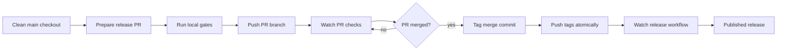

# Release process

Confii is a multi-module repository. A release is complete only when the root,
cloud-loader, and cloud-secret tags all identify the same reviewed commit. The
normal release path is scripted so maintainers do not have to reconstruct the
sequence from memory.

## Release flow



## Prepare the release PR

Run the release preparation script with the intended semantic version:

```bash
make release-prepare-pr VERSION=v2.1.1
```

This command:

- fetches `origin`,
- creates `release-vX.Y.Z` from `origin/main`,
- updates internal module requirements for the root, loader cloud, secret cloud,
  and cloud example modules,
- updates the default cloud-consumer test version,
- creates a `CHANGELOG.md` stub if the version is missing,
- runs release gates,
- commits with DCO sign-off,
- pushes the branch, and
- opens the release PR.

By default the script runs the heavy local gates:

```bash
make ci-full
make lint
make vulncheck
make supply-chain-check
make docs-check
```

For a dry metadata-only preparation, skip the gates or PR creation explicitly:

```bash
RELEASE_RUN_GATES=0 make release-prepare-pr VERSION=v2.1.1
RELEASE_OPEN_PR=0 make release-prepare-pr VERSION=v2.1.1
```

Review the generated changelog entry before merge. If the script inserted a
`TODO`, replace it with the actual release summary before asking for review.

## Watch the PR

Watch required checks until they pass or fail:

```bash
make release-watch-pr PR=95
```

If a check fails, the watcher prints the current PR check summary and recent
failed workflow runs for the PR branch. Inspect a failed run with:

```bash
make release-diagnose-run RUN_ID=30701360546
```

The diagnose command shows failed jobs and failure-oriented log excerpts. Use
that output to fix the branch, then rerun:

```bash
make release-watch-pr PR=95
```

## After merge

After the release PR is merged, run the post-merge release command:

```bash
make release-after-merge VERSION=v2.1.1 PR=95
```

This command:

- verifies the PR is merged,
- fetches `origin`,
- fast-forwards local `main`,
- verifies `main` matches the PR merge commit,
- refuses to continue if any release tag already exists,
- creates signed annotated tags:
  - `loader/cloud/vX.Y.Z`
  - `secret/cloud/vX.Y.Z`
  - `vX.Y.Z`
- verifies all tags resolve to the same merge commit,
- pushes the tags atomically,
- waits for the root-tag release workflow, and
- verifies the published GitHub release.

To create and verify tags locally without pushing them:

```bash
RELEASE_PUSH_TAGS=0 make release-after-merge VERSION=v2.1.1 PR=95
```

The root tag starts the release workflow. It re-runs module, race, and cloud
tests and checks all three tags and internal versions. A version-pinned
GoReleaser toolchain then cross-compiles the CLI, creates an SPDX JSON SBOM for
each archive, includes the SBOMs and applicable OpenVEX documents in the
release checksum manifest, and stages the GitHub release as a draft. The
release gate imports and re-exports every SBOM with commit-pinned
[bomctl](https://github.com/bomctl/bomctl), proving that the documents are
semantically consumable through the protobom model rather than merely valid
JSON. The workflow rejects incomplete release metadata before publication,
generates SLSA provenance for every checksummed archive, attaches the signed
Sigstore bundle as `confii-<tag>.intoto.jsonl`, and only then publishes the
release.

Tags and published releases are immutable. If a release is defective, publish a
new patch version; never move or replace a published tag.

## Continuity drill

The manual `Maintainer continuity drill` workflow verifies release-environment
approval, module checks, race tests, and a GoReleaser snapshot without creating
a tag or publishing a release. The snapshot must contain all expected archives,
per-archive SPDX SBOMs, OpenVEX documents, and checksum entries. The continuity
maintainer runs and approves this workflow as described in
[`CONTINUITY.md`](CONTINUITY.md). It is evidence that the release tooling remains
operable, not a substitute for the full production release procedure above.
