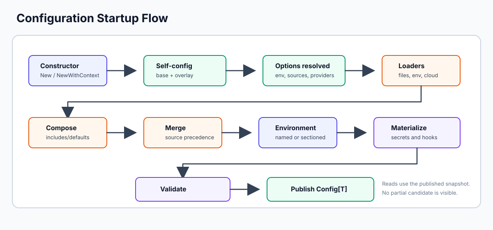

# Configuration

This page covers the three ways to configure a Confii instance, every available
option, and how priority resolution works between them.



For a complete empty-directory setup before using this reference, follow the
[Quick Start](quickstart.md).

---

## Three Ways to Configure Confii

Confii follows a **3-tier priority** model:

```
explicit code argument  >  self-config file  >  built-in default
```

If you pass `confii.WithMergeStrategy(confii.StrategyShallowMerge)` in code,
it wins over `merge.default: deep_merge` in self-config, which itself wins over
the built-in default.

---

### 1. Self-Configuration File (Zero-Code Defaults)

Confii auto-discovers a self-configuration file **before** any loaders run.
This is the best place for project-wide defaults shared by every developer.

Bootstrap the authoritative YAML template and a starter environment layout
with:

```bash
confii init
```

The command asks whether the project prefers separate environment files, a
single sectioned file, or self-configuration only, followed by YAML, JSON, or
TOML for the self-config format. The equivalent
automation flags are `--strategy named-files`, `--strategy sectioned`, and
`--minimal`; use `--format yaml|json|toml` to choose the format without a
prompt. The generated file contains every self-configurable startup
decision and is safe to use unchanged.

Initialization is idempotent and project-scoped. Confii checks every filename
in the discovery order below, validates an existing initialization, detects
ambiguous duplicates, and preflights all generated paths. It therefore does
not create a second self-config or partially overwrite a user's configuration.
Use `confii init --dry-run` before an intentional `--force` replacement. The
force path replaces only the selected plan and never deletes obsolete files
from a previous layout. A discovered self-config that is malformed or contains
an unknown top-level setting fails startup; provider-specific fields inside
`sources` and `secrets` remain extensible. The
maintained source template is
[`selfconfig/default.confii.yaml`](https://github.com/confiify/confii-go/blob/main/selfconfig/default.confii.yaml).

#### Search Order

Confii accepts exactly one base format per directory. It prefers the hidden
family (`.confii.yaml`, `.confii.yml`, `.confii.json`, or `.confii.toml`) and
uses the visible family (`confii.*`) only when no hidden base exists. A hidden
and visible base together, or two formats in one family, are ambiguous and fail
startup.

After reading the base, Confii selects an environment from an explicit
`WithEnv`, then `env_switcher`, then `default_environment`, and overlays the
matching same-family, same-format file, for example
`.confii.production.yaml`. An explicit empty `WithEnv("")` disables the
environment-specific self-config overlay. Overlay cache entries are scoped by
the selected environment and returned settings are detached copies. A
mismatched family or format fails clearly. If no project file exists, the same
discovery is attempted under `~/.config/confii/`.

=== "YAML"

    ```yaml title=".confii.yaml"
    # Environment
    default_environment: development
    env_switcher: APP_ENV          # read env name from this OS variable
    env_prefix: APP                # auto-add an EnvironmentLoader with this prefix

    # Select one primary environment model
    environment_strategy: named_files

    # Ordered sources: shared defaults, then selected environment
    sources:
      - type: environment_files
        search_paths: [config]
        default_file: default.yaml
        environment_file: "{environment}.yaml"
        default_required: true
        environment_required: true

    merge:
      default: deep_merge
      paths: {}
    use_env_expander: true
    use_file_resolver: false
    use_structured_resolver: false
    use_url_resolver: false
    use_command_resolver: false
    use_type_casting: true

    # Validation
    validate_on_load: false
    strict_validation: true
    schema_path: schema.json

    # Lifecycle and diagnostics
    dynamic_reloading: false
    reload_debounce: 150ms
    sensitive_paths: [database.password]

    # Error handling
    on_error: raise                # raise | warn | ignore
    ```

=== "JSON"

    ```json title=".confii.json"
    {
      "default_environment": "development",
      "env_switcher": "APP_ENV",
      "env_prefix": "APP",
      "merge": {"default": "deep_merge", "paths": {}},
      "use_env_expander": true,
      "use_file_resolver": false,
      "use_structured_resolver": false,
      "use_url_resolver": false,
      "use_command_resolver": false,
      "use_type_casting": true,
      "validate_on_load": false,
      "strict_validation": true,
      "dynamic_reloading": false,
      "reload_debounce": "150ms",
      "sensitive_paths": ["database.password"],
      "freeze_on_load": false,
      "debug_mode": false,
      "on_error": "raise",
      "environment_strategy": "named_files",
      "sources": [
        {
          "type": "environment_files",
          "search_paths": ["config"],
          "default_file": "default.yaml",
          "environment_file": "{environment}.yaml"
        }
      ]
    }
    ```

=== "TOML"

    ```toml title=".confii.toml"
    default_environment = "development"
    env_switcher = "APP_ENV"
    env_prefix = "APP"
    merge = { default = "deep_merge", paths = {} }
    use_env_expander = true
    use_file_resolver = false
    use_structured_resolver = false
    use_url_resolver = false
    use_command_resolver = false
    use_type_casting = true
    validate_on_load = false
    strict_validation = false
    dynamic_reloading = false
    reload_debounce = "150ms"
    sensitive_paths = ["database.password"]
    freeze_on_load = false
    debug_mode = false
    on_error = "raise"
    environment_strategy = "named_files"

    [[sources]]
    type = "environment_files"
    search_paths = ["config"]
    default_file = "default.yaml"
    environment_file = "{environment}.yaml"
    ```

These are intentionally single-model examples. All ordered inputs are declared
in `sources`; normal projects should not combine named and sectioned
environment models. Use explicit `hybrid` only for a controlled migration. The
generated YAML template is the exhaustive inventory of every available
decision.

#### Full Self-Config Settings Reference

| Setting | Type | Default | Description |
| --- | --- | --- | --- |
| `default_environment` | `string` | `""` | Default active environment name |
| `env_switcher` | `string` | `""` | OS variable to read environment name from |
| `env_prefix` | `string` | `""` | Auto-add a final `EnvironmentLoader` with this prefix after declarative sources |
| `merge.default` | `string` | `"deep_merge"` | Default strategy: `replace`, `shallow_merge`, `deep_merge`, `append`, `prepend`, `intersection`, or `union` |
| `merge.paths` | `map[string]string` | `{}` | Per-dotted-path strategy overrides |
| `use_env_expander` | `bool` | `true` | Enable `${VAR}` and `${env:VAR}` expansion in string values |
| `use_file_resolver` | `bool` | `false` | Enable opt-in `${file:path}` raw file-content expansion rooted at `WithWorkingDir` |
| `use_structured_resolver` | `bool` | `false` | Enable opt-in `${json:path#field}`, `${yaml:path#field}`, `${json:self#field}`, and `${yaml:self#field}` references |
| `use_url_resolver` | `bool` | `false` | Enable opt-in `${url:...}` response-body expansion |
| `use_command_resolver` | `bool` | `false` | Enable opt-in `${cmd:...}` shell-command stdout expansion |
| `use_type_casting` | `bool` | `true` | Auto-convert strings to bool/int/float |
| `sysenv_fallback` | `bool` | `false` | Opt into dynamic OS-env lookup for missing scalar `Get`/`Has` paths; values are not added to the published snapshot |
| `validate_on_load` | `bool` | `false` | Validate struct tags after loading |
| `strict_validation` | `bool` | `true` | Treat validation failures as errors when validation is enabled |
| `schema_path` | `string` | `""` | Path to a JSON Schema file for validation |
| `dynamic_reloading` | `bool` | `false` | Enable fsnotify file watching |
| `reload_debounce` | Go duration string | `"150ms"` | Coalesce filesystem event bursts before watcher-driven reload; `"0s"` reloads immediately |
| `sensitive_paths` | `[]string` | `[]` | Additional dot-separated paths to redact; parent paths protect every descendant |
| `freeze_on_load` | `bool` | `false` | Make config immutable after load |
| `startup.timeout` | Go duration string | `"60s"` | Overall initialization fallback when the caller context has no deadline; `"0s"` disables it |
| `runtime.timeout` | Go duration string | `"30s"` | Fallback for context-free runtime APIs and watcher-driven reloads; `"0s"` disables it |
| `secret_resolution_concurrency` | `int` | `4` | Bound concurrent eager secret-provider reads during startup and refresh |
| `debug_mode` | `bool` | `false` | Enable full source tracking and override history |
| `on_error` | `string` | `"raise"` | Error policy: `raise`, `warn`, or `ignore` |
| `log_level` | `string` | `""` | Log level for Confii's internal logger |
| `environment_strategy` | `string` | `"auto"` | Environment model: `auto`, `sectioned`, `named_files`, or explicit `hybrid` |
| `environment_conflict_policy` | `string` | `"last_wins"` | In hybrid mode: `error`, `warn`, or `last_wins`; it must be explicitly configured |
| `sources` | `[]map` | `[]` | Ordered declarative source definitions, including `environment_files` and registered opt-in cloud loaders |
| `secrets` | `map` | `{}` | Named provider instances under `providers`; each requires `type`. Supports `default_provider`, `environment_defaults`, and explicit `${secret@provider:key}` routing. |

!!! tip "When to use self-config"
    Self-configuration files are ideal for team-wide defaults that you commit to
    version control. Individual developers or CI pipelines can override specific
    settings via constructor options in code.

`WithWorkingDir` is intentionally code-level: it determines where Confii looks
for `.confii.yaml`, so the discovered file cannot relocate its own discovery
root. Inline Go schemas, custom loggers, custom hooks, and explicit loader
objects likewise remain code-level extension points; their declarative
counterparts are `schema_path`, `log_level`, `secrets`, and `sources`.
Cloud source field mappings and provider build tags are listed in
[Configuration Sources](sources.md#cloud-loaders).

#### Canonical Source Types

Core declarative sources use one unambiguous type name per behavior:

| `type` | Required field | Behavior |
| --- | --- | --- |
| `yaml` | `path` | Read YAML; `.yaml` and `.yml` paths are accepted |
| `json` | `path` | Read JSON from a `.json` path |
| `toml` | `path` | Read TOML from a `.toml` path |
| `ini` | `path` | Read INI; `.ini` and `.cfg` paths are accepted |
| `dotenv` | `path` | Read a dotenv file such as `.env`, `.env.local`, or `secrets.env` |
| `environment` | `prefix` | Read matching operating-system environment variables |
| `environment_files` | file-discovery fields | Load a default file followed by the selected environment file |

The declared file type is authoritative and must agree with its path. For
example, `type: yaml` with `path: config.json` fails during construction instead
of silently selecting the JSON parser. Filename conventions remain flexible:
`type: yaml` accepts `.yml`, and `type: ini` accepts `.cfg`.

Content is also parsed strictly according to the selected type. In particular,
a complete JSON document stored in a `.yaml` or `.yml` source is rejected even
though JSON is technically a subset of YAML. Confii never retries that content
with another parser. Auto-detection remains available only to APIs explicitly
using an unknown format, such as an HTTP response with neither a usable
Content-Type nor a recognized extension.

The v1 aliases `yml`, `cfg`, `envfile`, `env`, `env-vars`, and
`environment-files` are not accepted as v2 declarative types. Use `dotenv` for
files and `environment` for process variables; this removes the former
shape-dependent meaning of `env`.

This canonicalization applies to core source types only. Names registered by
optional cloud modules or through `RegisterSelfConfigSourceProvider` remain
valid extension points and are not rewritten or inferred by Confii.

#### Named Environment Files

Use an `environment_files` source when a project stores defaults and each
deployment environment in separate files:

```text
project/
├── .confii.yaml
└── config/
    ├── default.yaml
    ├── development.yaml
    ├── staging.yaml
    └── production.yaml
```

```yaml title=".confii.yaml"
default_environment: development
env_switcher: APP_ENV
environment_strategy: named_files

sources:
  - type: environment_files
    search_paths:
      - config
      - .
    default_file: default.yaml
    environment_file: "{environment}.yaml"
    default_required: false
    environment_required: true
```

The active environment is resolved with the normal precedence: explicit
`WithEnv`, then the value named by `env_switcher`, then
`default_environment`. Confii searches each role independently. With the
configuration above it:

1. Loads the first `default.yaml` found in `config/`, then the project root.
2. Loads the first `{environment}.yaml` found in the same search order.
3. Deep-merges the environment layer over the default layer.

Declaring `environment_files` infers `named_files` when the strategy is
omitted. Flat sources may be placed before or after it, preserving normal
ordered precedence. If another source is recognized as a section-based
environment file (`default:` plus environment sections), construction fails
with a typed configuration error instead of silently combining both models.

For a deliberate migration, opt into hybrid mode and choose how overlapping
keys are handled:

```yaml
environment_strategy: hybrid
environment_conflict_policy: error # error | warn | last_wins

sources:
  - type: yaml
    path: config/application.yaml
  - type: environment_files
    search_paths: [config, .]
```

Hybrid mode requires both environment models to load. Confii compares their
resolved leaf keys. `error` rejects overlaps with the complete source chain,
`warn` logs them and continues, and `last_wins` preserves declared loader
order. Overrides within one model—such as `default.yaml` followed by
`production.yaml`—remain expected and are not reported as mixed-model
conflicts.

Run `confii plan production` to inspect the inferred strategy, ordered layer
roles, key counts, and any permitted hybrid conflicts before deployment.

Relative search paths are resolved from `WithWorkingDir`, or from the
self-config working directory when no explicit working directory is supplied.
Absolute search paths are also accepted. Named files support the same formats
as declarative file sources: YAML, JSON, TOML, INI/CFG, and `.env`; change the
two filename patterns accordingly.

`default_required` defaults to `false`. `environment_required` defaults to
`true` when an environment is selected; when no environment is selected, only
the optional/default role is considered. Environment names are restricted to
letters, digits, `.`, `_`, and `-` and cannot contain `..`, path separators, or
other traversal characters.

This feature does not change existing loading modes:

- `type: yaml` with an `application.yaml` containing top-level `default`,
  `development`, or `production` sections continues to resolve those sections.
- Declarative `sources`, explicit `WithLoaders`, and
  builder-provided loaders retain their existing precedence and behavior.
- Explicit loaders suppress self-config sources, as before.

---

### 2. Constructor with Options

Pass functional options directly to `confii.New`:

```go
cfg, err := confii.New[AppConfig](
    confii.WithLoaders(
        loader.NewYAML("config.yaml"),
        loader.NewEnvironment("APP"),
    ),
    confii.WithEnv("production"),
    confii.WithMergeStrategy(confii.StrategyMerge),
    confii.WithValidateOnLoad(true),
    confii.WithStrictValidation(true),
    confii.WithOnError(confii.ErrorPolicyWarn),
)
```

This is the most common approach for application code.

`New` creates an implicit background context and bounds the complete startup
pipeline with the configured fallback timeout. When startup must inherit a
caller deadline, cancellation signal, or context values, use the explicit
variant:

```go
ctx, cancel := context.WithTimeout(context.Background(), 15*time.Second)
defer cancel()

cfg, err := confii.NewWithContext[AppConfig](ctx,
    confii.WithLoaders(loader.NewYAML("config.yaml")),
)
```

Confii never replaces or extends an existing context deadline. If
`NewWithContext` receives a context without a deadline, the same fallback used by
`New` is applied.

#### Complete Options Reference

| Option | Purpose | Default |
| --- | --- | --- |
| `WithLoaders(loaders...)` | Set the ordered list of configuration sources. Later loaders override earlier ones. | none |
| `WithEnv(name)` | Set the active environment (e.g. `"production"`, `"staging"`). | `""` |
| `WithEnvironmentStrategy(strategy)` | Select the environment model; explicit options override self-config. | `EnvironmentStrategyAuto` |
| `WithEnvironmentConflictPolicy(policy)` | Control mixed sectioned/named conflicts in hybrid mode. | `EnvironmentConflictLastWins` |
| `WithStartupTimeout(duration)` | Set the overall startup fallback when the caller supplies no deadline; `0` disables it. | `60s` |
| `WithSecretResolutionConcurrency(limit)` | Bound concurrent eager secret-provider reads. | `4` |
| `WithOperationTimeout(duration)` | Bound context-free runtime APIs and watcher-triggered reloads; `0` disables it. | `30s` |
| `WithEnvSwitcher(envVar)` | Read the environment name from the given OS variable at startup. | none |
| `WithEnvPrefix(prefix)` | Auto-add an `EnvironmentLoader` with this prefix (e.g. `"APP"` reads `APP_*` vars). | none |
| `WithMergeStrategy(strategy)` | Set the default merge strategy for all paths. | `Merge` |
| `WithMergeStrategyMap(map)` | Set per-path merge strategy overrides (e.g. `"database"` uses `Replace`). | none |
| `WithEnvExpander(bool)` | Enable `${VAR}` and `${env:VAR}` expansion in string values using OS environment variables. | `true` |
| `WithFileResolver(bool)` | Enable `${file:path}` raw file-content expansion rooted at `WithWorkingDir`. | `false` |
| `WithStructuredResolver(bool)` | Enable `${json:path#field}`, `${yaml:path#field}`, `${json:self#field}`, and `${yaml:self#field}` value references. | `false` |
| `WithURLResolver(bool)` | Enable `${url:...}` response-body expansion. | `false` |
| `WithCommandResolver(bool)` | Enable `${cmd:...}` shell-command stdout expansion. | `false` |
| `WithValueResolver(scheme, resolver)` | Add or override a custom `${scheme:...}` resolver. | none |
| `WithTypeCasting(bool)` | Auto-convert string values to `bool`/`int`/`float64` when accessed. | `true` |
| `WithSysenvFallback(bool)` | Fall back to OS environment variables when a key is not found in config. | `false` |
| `WithValidateOnLoad(bool)` | Validate the typed struct (via `go-playground/validator` tags) immediately after loading. | `false` |
| `WithStrictValidation(bool)` | Treat validation failures as errors (requires `WithValidateOnLoad`). | `true` |
| `WithValidator(validator)` | Add a transactional validation rule and enable validation. | none |
| `WithExporter(exporter)` | Add a serializer or replace a built-in export format. | JSON/YAML/TOML built in |
| `WithSchema(schema)` | Set a validation schema (struct type or JSON Schema dict). | none |
| `WithSchemaPath(path)` | Set the path to a JSON Schema file for validation. | none |
| `WithFreezeOnLoad(bool)` | Make the config immutable after initialization. `Set()` returns `ErrConfigFrozen`. | `false` |
| `WithDynamicReloading(bool)` | Enable fsnotify file watching for automatic reload on change. | `false` |
| `WithReloadDebounce(duration)` | Coalesce filesystem event bursts before automatic reload. | `150ms` |
| `WithSensitivePaths(paths...)` | Mark application-defined paths for redaction throughout the snapshot lifecycle. | none |
| `WithDebugMode(bool)` | Enable full source tracking, override history, and debug reports. | `false` |
| `WithOnError(policy)` | Set the error handling policy for loader failures. | `ErrorPolicyRaise` |
| `WithLogger(logger)` | Set a custom `*slog.Logger` for Confii's internal logging. | `slog.Default()` |

!!! note "Defaults for `WithEnvExpander` and `WithTypeCasting`"
    Both of these default to `true` in the built-in defaults. This means string
    values containing `${VAR}` patterns are expanded, and strings like `"true"`,
    `"8080"`, and `"3.14"` are automatically coerced to their native Go types
    unless you explicitly disable them.

---

### 3. Builder Pattern

The builder provides a fluent API for constructing `Config` instances. It is
especially useful when configuration construction is conditional or spans
multiple steps:

```go
builder := confii.NewBuilder[AppConfig]()

// Conditionally add loaders
builder.AddLoader(loader.NewYAML("config/base.yaml"))

if os.Getenv("APP_ENV") == "production" {
    builder.AddLoader(loader.NewYAML("config/prod.yaml"))
    builder.WithEnv("production")
} else {
    builder.AddLoader(loader.NewYAML("config/dev.yaml"))
    builder.WithEnv("development")
}

// Chain additional settings
cfg, err := builder.
    WithMergeStrategy(confii.StrategyMerge).
    EnableFreezeOnLoad().
    EnableDebug().
    BuildWithContext(ctx)
```

#### Builder Methods Reference

| Method | Description |
| --- | --- |
| `WithEnv(name)` | Set the active environment |
| `AddLoader(loader)` | Append a single loader to the source list |
| `AddLoaders(loaders...)` | Append multiple loaders |
| `WithMergeStrategy(strategy)` | Select the default merge policy |
| `EnableEnvExpander()` | Enable `${VAR}` expansion |
| `DisableEnvExpander()` | Disable `${VAR}` expansion |
| `EnableTypeCasting()` | Enable automatic type casting |
| `DisableTypeCasting()` | Disable automatic type casting |
| `EnableDynamicReloading()` | Enable fsnotify file watching |
| `DisableDynamicReloading()` | Disable file watching |
| `EnableDebug()` | Enable debug/source tracking mode |
| `EnableFreezeOnLoad()` | Freeze config after loading |
| `WithSchemaValidation(schema, strict)` | Set schema, enable validate-on-load, and set strict mode |
| `Build()` | Create the `Config` with an implicit startup context and fallback timeout |
| `BuildWithContext(ctx)` | Create the `Config` with an explicit startup context |

!!! tip "Builder vs Constructor"
    `Build()` delegates to `confii.New`; `BuildWithContext(ctx)` delegates to
    `confii.NewWithContext(ctx)`. Apart from context ownership, there is no
    functional difference -- choose whichever style reads better in your code.
    The builder shines when you need to conditionally compose loaders or split
    setup across multiple functions.

---

## Priority Resolution

Understanding how the three configuration methods interact is key to avoiding
surprises. Confii resolves each setting independently using this priority:

```
1. Explicit code argument    (highest priority)
2. Self-config file value
3. Built-in default          (lowest priority)
```

### Example

Given this self-config file:

```yaml title=".confii.yaml"
merge:
  default: shallow_merge
use_env_expander: true
use_file_resolver: false
use_structured_resolver: false
use_url_resolver: false
use_command_resolver: false
default_environment: staging
```

And this constructor call:

```go
cfg, err := confii.NewWithContext[any](ctx,
    confii.WithMergeStrategy(confii.StrategyMerge),   // explicit override
    confii.WithEnv("production"), // explicit override
)
```

The resolved values are:

| Setting | Self-Config | Explicit | Resolved | Source |
| --- | --- | --- | --- | --- |
| `deep_merge` | `false` | `true` | **`true`** | explicit wins |
| `use_env_expander` | `true` | *(not set)* | **`true`** | self-config wins over built-in |
| `use_file_resolver` | `false` | *(not set)* | **`false`** | built-in default remains off |
| `use_structured_resolver` | `false` | *(not set)* | **`false`** | built-in default remains off |
| `use_url_resolver` | `false` | *(not set)* | **`false`** | built-in default remains off |
| `use_command_resolver` | `false` | *(not set)* | **`false`** | built-in default remains off |
| `env` | `staging` | `production` | **`production`** | explicit wins |
| `freeze_on_load` | *(not set)* | *(not set)* | **`false`** | built-in default |

---

## Error Policies

The `WithOnError` option controls how Confii handles loader failures (e.g., a
file that doesn't exist or a cloud endpoint that times out).

```go
confii.WithOnError(confii.ErrorPolicyRaise)   // default
confii.WithOnError(confii.ErrorPolicyWarn)
confii.WithOnError(confii.ErrorPolicyIgnore)
```

| Policy | Behavior |
| --- | --- |
| `ErrorPolicyRaise` | Return the error immediately from `confii.New`. The application cannot start with a broken config source. This is the **default**. |
| `ErrorPolicyWarn` | Log a warning via `slog` and continue loading from remaining sources. Useful when some sources are optional. |
| `ErrorPolicyIgnore` | Silently skip failed loaders. Use with caution -- you may end up with missing configuration without any indication. |

!!! warning "Choose `Raise` for production"
    `ErrorPolicyRaise` is the safest default. Use `Warn` only for genuinely
    optional sources (e.g., a local override file that may not exist in CI).
    Avoid `Ignore` unless you have other mechanisms to detect missing config.

### Error Policy Example

```go
// Optional local overrides -- warn if missing, don't fail
cfg, err := confii.NewWithContext[any](ctx,
    confii.WithLoaders(
        loader.NewYAML("config/base.yaml"),       // required
        loader.NewYAML("config/local.yaml"),       // optional
        loader.NewEnvironment("APP"),
    ),
    confii.WithOnError(confii.ErrorPolicyWarn),    // (1)!
)
```

1. If `config/local.yaml` doesn't exist, Confii logs a warning and continues
   with the remaining sources.

!!! note
    The error policy applies to all loaders uniformly. If you need different
    policies for different sources, consider loading them in separate steps
    using `cfg.Extend()` after initial construction.

---

## Initialization Sequence

When `confii.New` is called, Confii executes these steps in order:

1. **Apply constructor options** -- merge user-provided `With*` options into defaults
2. **Read self-config** -- discover and parse `.confii.yaml` (or equivalent), apply non-overridden settings
3. **Resolve environment** -- if `WithEnvSwitcher` is set, read the OS variable to determine the active environment
4. **Set up merger** -- configure the merge engine (default or advanced with per-path strategies)
5. **Register built-in hooks** -- enable environment expansion, type casting,
   and a constructor-supplied secret hook when configured
6. **Load all sources** -- call each loader in order, compose `_include`/`_defaults`, track sources, merge results
7. **Resolve environment sections** -- merge `default` + active environment section
8. **Materialize the effective configuration** -- expand environment values,
   convert built-in scalar types, resolve and deduplicate secret references,
   and retain the unresolved selected snapshot for refresh/introspection
9. **Validate** -- if `WithValidateOnLoad` is set, validate JSON Schema and/or
   apply the access hook pipeline before decoding and validating the typed struct
10. **Freeze** -- if `WithFreezeOnLoad` is set, lock the config against further changes
11. **Start watcher** -- if `WithDynamicReloading` is set, begin watching source files via fsnotify

!!! tip "Debug the initialization"
    Enable `WithDebugMode(true)` to get full source tracking. After loading, call
    `cfg.Layers()` to see which sources contributed which keys, or
    `cfg.Explain("database.host")` to trace a specific value back to its origin.
