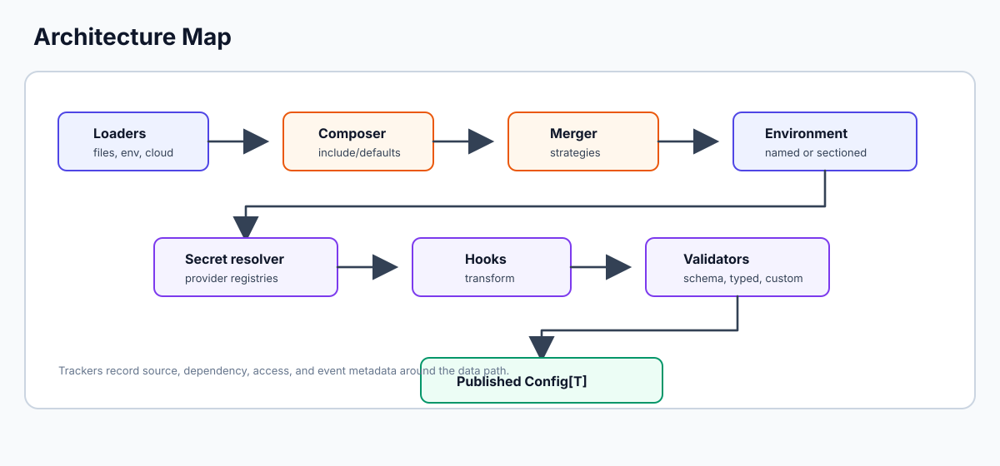

# Extensibility

Confii is extensible at the same boundaries it uses internally: sources,
secrets, hooks, validation, exporters, runtime extension, and provider
registration.



## Extension Points

| Extension point | Use it for |
| --- | --- |
| `Loader` | Read configuration from a new source such as Consul, Redis, SQL, or an internal API |
| `SecretStore` | Resolve secrets from a custom backend |
| Hooks | Transform or normalize values before validation and publication |
| `Validator` | Enforce application-specific invariants |
| `Exporter` | Add or replace an export format |
| `Extend` | Add a runtime source transactionally |
| Provider registries | Add declarative `.confii.yaml` source or secret providers |

## Custom Loaders

Implement `confii.Loader`:

```go
type Loader interface {
    Load(ctx context.Context) (map[string]any, error)
    Source() string
}
```

Rules:

- Honor context cancellation for blocking work.
- Return `(nil, nil)` only for intentional graceful absence.
- Return an error for malformed data, authorization failures, transport
  failures, or parse failures.
- Keep `Source()` stable and non-sensitive; it appears in diagnostics.
- Return a map owned by Confii. Do not mutate it after returning.

Example:

```go
type ConsulLoader struct {
    client *consul.Client
    prefix string
}

func (l *ConsulLoader) Source() string {
    return "consul:" + l.prefix
}

func (l *ConsulLoader) Load(ctx context.Context) (map[string]any, error) {
    pairs, _, err := l.client.KV().List(l.prefix, nil)
    if err != nil {
        return nil, err
    }
    if len(pairs) == 0 {
        return nil, nil
    }
    result := map[string]any{}
    for _, pair := range pairs {
        key := strings.TrimPrefix(pair.Key, l.prefix+"/")
        key = strings.ReplaceAll(key, "/", ".")
        if err := configmap.Set(result, key, string(pair.Value)); err != nil {
            return nil, fmt.Errorf("map key %q: %w", pair.Key, err)
        }
    }
    return result, nil
}
```

Use it as a normal layer:

```go
cfg, err := confii.New[AppConfig](
    confii.WithLoaders(
        loader.NewYAML("config/default.yaml"),
        &ConsulLoader{client: client, prefix: "myapp"},
    ),
)
```

## Custom Secret Stores

Implement `confii.SecretStore`:

```go
type SecretStore interface {
    GetSecret(ctx context.Context, key string, opts ...SecretOption) (any, error)
    SetSecret(ctx context.Context, key string, value any, opts ...SecretOption) error
    DeleteSecret(ctx context.Context, key string, opts ...SecretOption) error
    ListSecrets(ctx context.Context, prefix string) ([]string, error)
}
```

Rules:

- Honor context cancellation.
- Return `ErrSecretNotFound` only for genuine absence.
- Wrap authentication, authorization, transport, and backend failures with
  `ErrSecretAccess` or `ErrSecretStore`.
- Do not log or expose secret values through errors.
- Treat `SecretOption` values such as version and field explicitly. If the
  backend cannot support one, return a clear error instead of silently ignoring
  it.
- Make the store safe for the concurrency it advertises.

Example skeleton:

```go
type RedisSecretStore struct {
    client *redis.Client
}

func (s *RedisSecretStore) GetSecret(ctx context.Context, key string, opts ...confii.SecretOption) (any, error) {
    options := confii.ResolveSecretOptions(opts...)
    if options.Version != "" {
        return nil, fmt.Errorf("%w: Redis store does not support versions", confii.ErrSecretStore)
    }
    value, err := s.client.Get(ctx, "secrets:"+key).Result()
    if errors.Is(err, redis.Nil) {
        return nil, fmt.Errorf("%w: %s", confii.ErrSecretNotFound, key)
    }
    if err != nil {
        return nil, fmt.Errorf("%w: read Redis secret %s: %v", confii.ErrSecretStore, key, err)
    }
    return value, nil
}

func (s *RedisSecretStore) SetSecret(ctx context.Context, key string, value any, opts ...confii.SecretOption) error {
    return s.client.Set(ctx, "secrets:"+key, value, 0).Err()
}

func (s *RedisSecretStore) DeleteSecret(ctx context.Context, key string, opts ...confii.SecretOption) error {
    return s.client.Del(ctx, "secrets:"+key).Err()
}

func (s *RedisSecretStore) ListSecrets(ctx context.Context, prefix string) ([]string, error) {
    return nil, fmt.Errorf("%w: listing is not implemented", confii.ErrSecretStore)
}
```

Wire it through the resolver:

```go
resolver := secret.NewResolver(&RedisSecretStore{client: rdb}, secret.WithCache(true))
cfg, err := confii.New[AppConfig](confii.WithSecretResolver(resolver))
```

## Hooks

Use hooks for transformations that should be visible in every read surface:

```go
cfg, err := confii.New[AppConfig](
    confii.WithKeyHook("app.name", func(ctx context.Context, key string, value any) (any, error) {
        s, ok := value.(string)
        if !ok {
            return nil, fmt.Errorf("%s must be string", key)
        }
        return strings.TrimSpace(s), nil
    }),
)
```

Hooks run before validation and publication. Returning an error rejects the
candidate.

## Custom Value Resolvers

Use a value resolver when you want configuration authors to write a compact
`${scheme:...}` expression instead of a general-purpose hook. Resolvers receive
the parsed request and may return any Go value:

```go
cfg, err := confii.New[AppConfig](
    confii.WithValueResolver("upper", func(ctx context.Context, req hook.ResolverRequest) (any, error) {
        if err := ctx.Err(); err != nil {
            return nil, err
        }
        return strings.ToUpper(req.Target), nil
    }),
)
```

Config:

```yaml
display_name: ${upper:confii}
```

`ResolverRequest` contains:

| Field | Meaning |
| --- | --- |
| `Scheme` | Lower-level scheme name, such as `upper` |
| `Target` | Text between `scheme:` and optional `#` |
| `Fragment` | Text after `#`, useful for field selection |
| `Key` | Dot-separated config key being materialized |

Rules:

- Honor context cancellation before blocking I/O.
- Return errors for missing, unauthorized, malformed, or unsafe values.
- Do not log sensitive resolved values.
- Keep resolver schemes stable and lowercase-friendly.
- Treat resolvers as startup/materialization work, not per-read work.

Custom resolvers run in the same value-reference phase as built-ins. If a
custom scheme matches a built-in scheme, the custom resolver overrides the
built-in for that configuration.

## Custom Validators

Use validators for domain rules:

```go
type productionPolicy struct{}

func (productionPolicy) Validate(data map[string]any) error {
    env, _ := data["environment"].(string)
    debug, _ := data["debug"].(bool)
    if env == "production" && debug {
        return errors.New("debug must be disabled in production")
    }
    return nil
}

cfg, err := confii.New[AppConfig](confii.WithValidator(productionPolicy{}))
```

Validators receive an independent copy. They must not be used as transformers.

## Custom Exporters

Implement `Exporter` when an application needs a non-built-in export format or
wants to replace the default JSON/YAML/TOML behavior.

```go
type Exporter interface {
    Format() string
    Export(config map[string]any) ([]byte, error)
}
```

Register before construction:

```go
cfg, err := confii.New[AppConfig](
    confii.WithExporter(myExporter{}),
)
```

Exporter format names must be stable lowercase identifiers. Exporters receive
the effective snapshot; they must handle secret material carefully.

## Runtime Source Extension

Add a source after initialization:

```go
err := cfg.ExtendWithContext(ctx, loader.NewYAML("tenant/acme.yaml"))
```

The new source is merged at the highest precedence position and included in
future reloads. Publication is transactional.

## Declarative Provider Registries

Provider packages can register declarative source or secret implementations so
applications can use them from `.confii.yaml`.

Rules:

- Register once, normally from package `init`.
- Use a stable canonical type name.
- Validate provider-specific fields in the factory.
- Reject unsafe paths, traversal, ambiguous credentials, and secret-bearing
  source identifiers.
- Keep optional provider dependencies outside the core module when possible.

See [Architecture](ARCHITECTURE.md#3-self-config-provider-registries).

## Extension Testing Checklist

- Cancellation: blocking calls return when `ctx` is canceled.
- Error categories: expected errors wrap Confii sentinel errors.
- Redaction: `Source()` and errors do not contain secrets.
- Concurrency: shared clients and caches are safe.
- Graceful absence: missing optional source returns `(nil, nil)`.
- Publication: failed load/validation does not mutate the previous snapshot.
- Introspection: `Explain`, `Layers`, and debug reports show useful source
  names.
- Path safety: external keys cannot escape intended prefixes.
