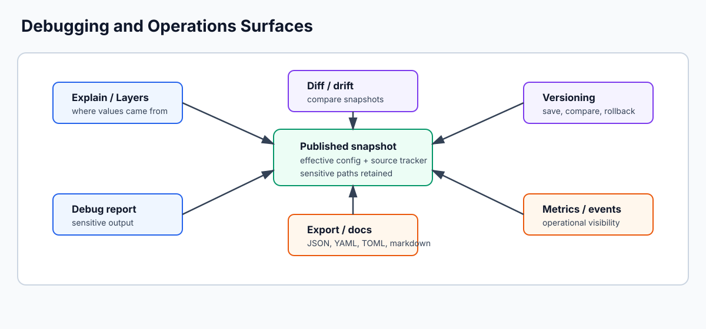

# Observability

Confii provides built-in observability through two systems: **metrics collection** for tracking access patterns and reload statistics, and **event emission** for reacting to configuration changes in real-time.

For trace and request correlation, `OnChangeWithContext` and
`EventSubscriber.OnWithContext` receive the originating operation context. See
[Context, cancellation, and operation lifecycles](context.md).



---

## Metrics Collection

### Enabling Metrics

```go
metrics := cfg.EnableObservability()
```

`EnableObservability` returns a `confii.MetricsReader` view. Once enabled,
Confii automatically records successful `Get`/`GetWithContext` accesses,
reloads, extensions, mutations, failures, and change events. Failed key lookups
are not counted as accesses. The view exposes detached statistics without
granting mutation access to Confii's collector.

### Reading Statistics

```go
stats := cfg.GetMetrics()
if stats == nil {
    log.Println("observability not enabled")
    return
}

fmt.Println(stats)
```

The returned map contains:

| Key | Type | Description |
|-----|------|-------------|
| `total_keys` | `int` | Total number of configuration keys |
| `accessed_keys` | `int` | Number of distinct keys that have been accessed |
| `access_rate` | `float64` | Ratio of accessed keys to total keys (0.0 to 1.0) |
| `top_accessed_keys` | `map[string]int` | Top 10 most accessed keys with their counts |
| `reload_count` | `int` | Total number of reloads |
| `avg_reload_time` | `string` | Average reload duration |
| `change_count` | `int` | Total number of change events |
| `last_reload` | `time.Time` | Timestamp of the last reload (if any) |
| `last_change` | `time.Time` | Timestamp of the last change (if any) |

**Example output:**

```go
map[string]any{
    "total_keys":        15,
    "accessed_keys":     8,
    "access_rate":       0.533,
    "top_accessed_keys": map[string]int{
        "database.host": 42,
        "database.port": 38,
        "app.name":      25,
    },
    "reload_count":      3,
    "avg_reload_time":   "12.5ms",
    "change_count":      2,
    "last_reload":       time.Time{...},
}
```

### Metrics Control

```go
metrics := cfg.EnableObservability() // starts or resumes collection
cfg.DisableObservability()           // pause collection; retain existing data
cfg.ResetMetrics()                   // clear retained data
cfg.EnableObservability()            // resume collection
```

---

## Event Emission

### Enabling Events

```go
emitter := cfg.EnableEvents()
```

`EnableEvents` returns a `confii.EventSubscriber`. It can register and remove
listeners but cannot emit fabricated Config lifecycle events.

### Event Types

| Event | When it fires | Arguments |
|-------|---------------|-----------|
| `reload` | After a successful reload | `config map[string]any`, `duration time.Duration` |
| `extend` | After a source is successfully added | `config map[string]any`, `duration time.Duration` |
| `set` | After `Set` publishes | `key string`, `value any` |
| `override` | After an override is applied | `overrides map[string]any` |
| `override_restored` | After an override frame is restored | `config map[string]any` |
| `secrets_refreshed` | After refreshed secrets are published | `nil`, `duration time.Duration` |
| `rollback` | After a version is restored | `versionID string`, `config map[string]any` |
| `change` | After any successful snapshot mutation | `oldConfig map[string]any`, `newConfig map[string]any` |

Operation-specific events are delivered before the generic `change` event.
The maps supplied to `change` are detached snapshots and cannot mutate the live
Config. Superseded optimistic transaction attempts emit nothing; one committed
operation produces one operation event and one `change` event.

### On / Off Pattern

**Register a listener:**

```go
emitter.On("reload", func(args ...any) {
    config := args[0].(map[string]any)
    duration := args[1].(time.Duration)
    log.Printf("Config reloaded in %v with %d keys", duration, len(config))
})

emitter.On("change", func(args ...any) {
    oldConfig := args[0].(map[string]any)
    newConfig := args[1].(map[string]any)
    log.Printf("Config changed: %d keys before, %d keys after",
        len(oldConfig), len(newConfig))
})
```

**Remove the last registered listener:**

```go
emitter.Off("reload") // removes the most recently registered reload listener
```

For independent application events, construct a separate
`observe.NewEventEmitter`; it is intentionally not the Config-owned lifecycle
emitter.

!!! tip "Chaining"
    `On` returns the emitter and supports chained registrations:

    ```go
    emitter.
        On("reload", reloadHandler).
        On("change", changeHandler)
    ```

!!! note "Panic safety"
    Listener panics are caught, logged, and do not propagate. A panic in one listener does not prevent other listeners from running.

---

## Integration Patterns

### Logging

```go
emitter := cfg.EnableEvents()

emitter.On("reload", func(args ...any) {
    duration := args[1].(time.Duration)
    slog.Info("config reloaded", slog.Duration("duration", duration))
})

emitter.On("change", func(args ...any) {
    slog.Info("config changed")
})
```

### Prometheus Metrics

```go
var (
    configReloads = promauto.NewCounter(prometheus.CounterOpts{
        Name: "config_reloads_total",
        Help: "Total number of configuration reloads",
    })
    configReloadDuration = promauto.NewHistogram(prometheus.HistogramOpts{
        Name:    "config_reload_duration_seconds",
        Help:    "Duration of configuration reloads",
        Buckets: prometheus.DefBuckets,
    })
    configChanges = promauto.NewCounter(prometheus.CounterOpts{
        Name: "config_changes_total",
        Help: "Total number of configuration changes",
    })
)

emitter := cfg.EnableEvents()

emitter.On("reload", func(args ...any) {
    duration := args[1].(time.Duration)
    configReloads.Inc()
    configReloadDuration.Observe(duration.Seconds())
})

emitter.On("change", func(args ...any) {
    configChanges.Inc()
})
```

### Periodic Statistics Reporting

```go
cfg.EnableObservability()

go func() {
    ticker := time.NewTicker(60 * time.Second)
    defer ticker.Stop()
    for range ticker.C {
        stats := cfg.GetMetrics()
        if stats != nil {
            slog.Info("config stats",
                slog.Int("accessed_keys", stats["accessed_keys"].(int)),
                slog.Int("reload_count", stats["reload_count"].(int)),
                slog.Float64("access_rate", stats["access_rate"].(float64)),
            )
        }
    }
}()
```

### Combined Observability Setup

```go
func setupObservability(cfg *confii.Config[any]) {
    // Enable metrics
    cfg.EnableObservability()

    // Enable events
    emitter := cfg.EnableEvents()

    // Log all events
    emitter.On("reload", func(args ...any) {
        duration := args[1].(time.Duration)
        log.Printf("[config] reloaded in %v", duration)
    })

    emitter.On("change", func(args ...any) {
        log.Println("[config] values changed")
    })

    // Register change callbacks for specific keys
    cfg.OnChange(func(key string, oldVal, newVal any) {
        log.Printf("[config] %s: %v -> %v", key, oldVal, newVal)
    })
}
```

---

## Full Example

```go
package main

import (
    "context"
    "fmt"
    "log"
    "time"

    confii "github.com/confiify/confii-go/v2"
    "github.com/confiify/confii-go/v2/loader"
)

func main() {
    ctx := context.Background()

    cfg, err := confii.NewWithContext[any](ctx,
        confii.WithLoaders(loader.NewYAML("config.yaml")),
        confii.WithEnv("production"),
    )
    if err != nil {
        log.Fatal(err)
    }

    // Enable metrics
    metrics := cfg.EnableObservability()

    // Enable events
    emitter := cfg.EnableEvents()
    emitter.On("reload", func(args ...any) {
        duration := args[1].(time.Duration)
        fmt.Printf("Reloaded in %v\n", duration)
    })
    emitter.On("change", func(args ...any) {
        fmt.Println("Config values changed")
    })

    // Successful Config reads are tracked automatically
    _, _ = cfg.Get("database.host")
    _, _ = cfg.Get("database.host")
    _, _ = cfg.Get("database.port")

    // Trigger a reload
    _ = cfg.ReloadWithContext(ctx)

    // Print statistics
    stats := cfg.GetMetrics()
    fmt.Printf("\nStatistics:\n")
    fmt.Printf("  Total keys:    %v\n", stats["total_keys"])
    fmt.Printf("  Accessed keys: %v\n", stats["accessed_keys"])
    fmt.Printf("  Access rate:   %.1f%%\n", stats["access_rate"].(float64)*100)
    fmt.Printf("  Reload count:  %v\n", stats["reload_count"])
    fmt.Printf("  Change count:  %v\n", stats["change_count"])
    fmt.Printf("  Top accessed:  %v\n", stats["top_accessed_keys"])
}
```
